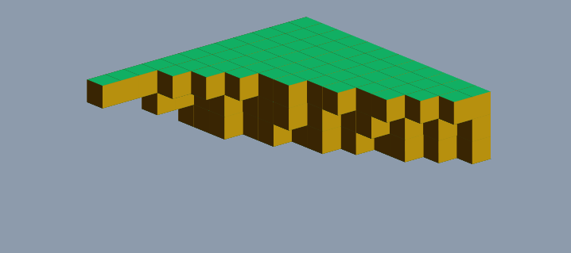

# Isometrics



Experiments with Isometric cubes using CSS and DOM elements. Different POC's around the baics concept of using CSS to create a cube. You can rotate the view using the arrow keys. This was an older repository and experiment that I am coming back to play with and clean up.

## Change Log

- Update to build and cube code.
- Isometric Map Render http://isometric_map.surge.sh
- Keypress (arrow keys) to rotate perspective.
- Simplex Noise and Animation http://isometric_test.surge.sh
- New render to create text from blocks.
- Isometric Cubs with CSS.
- Initial Commit - Taken from my older flash/actionscript work. http://isometric_block.surge.sh

## Run the example

Requires Node v8.9.2 or greater.

```bash
$ yarn install
$ yarn run dev
```

open http://localhost:2020
